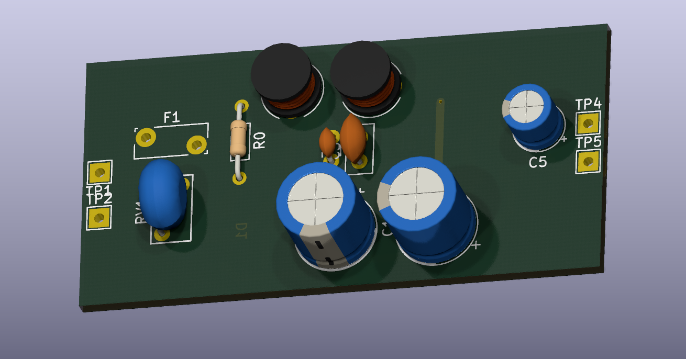
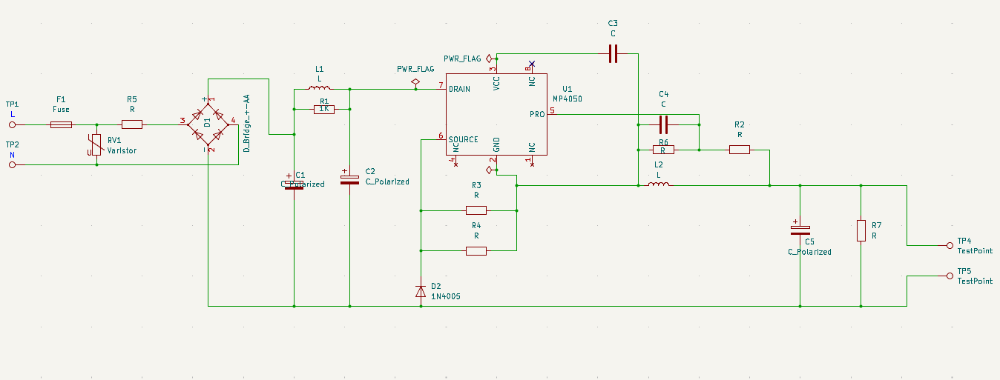
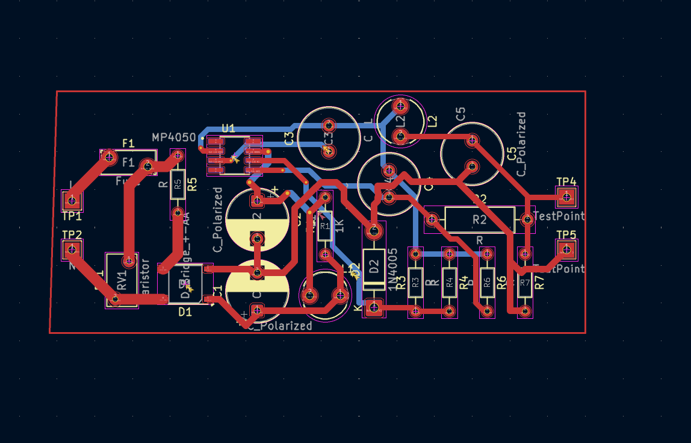
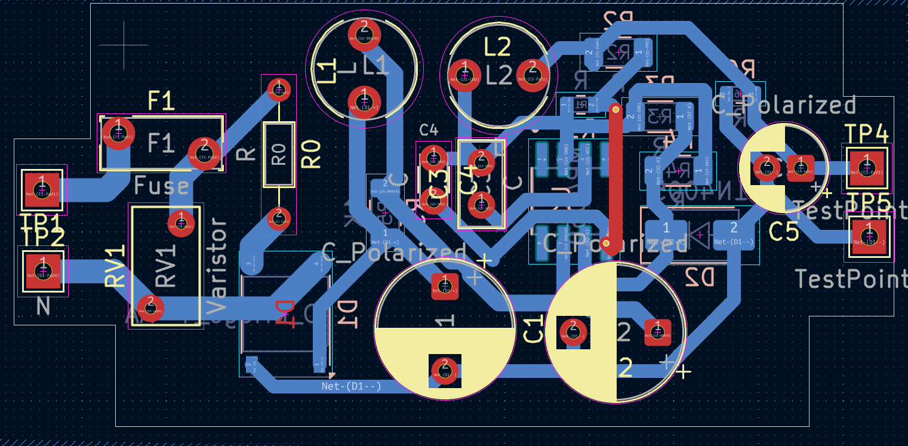
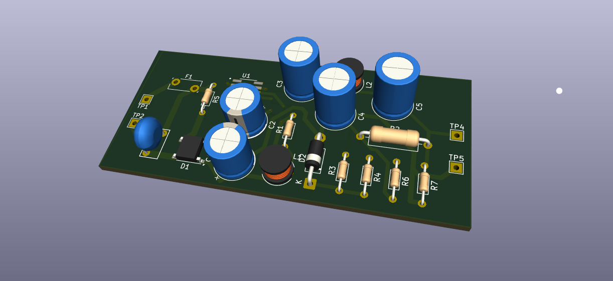
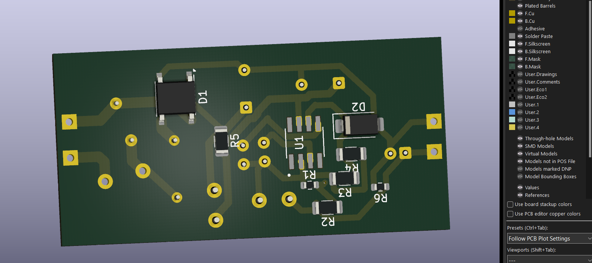
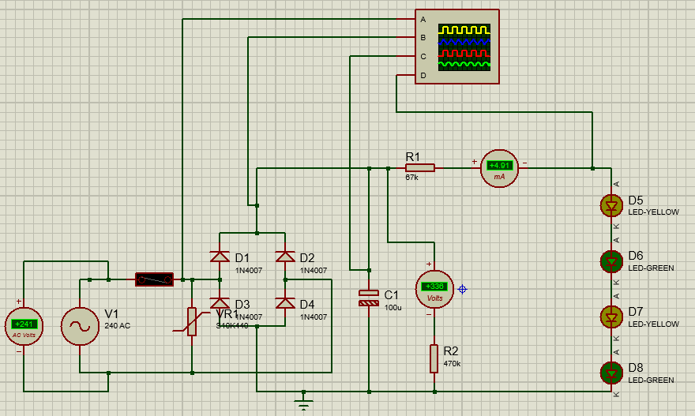

# LED Bulb PCB Design and Development



## Project Overview

This repository documents the design and development of a **5 W, 240 VAC LED bulb PCB**. The project follows the complete engineering workflow from schematic capture and PCB layout to simulation, PCB manufacturing, assembly and hardware testing.

The aim is to design an affordable, reliable and energy-efficient LED bulb suitable for indoor lighting while gaining practical experience in professional PCB design and electronics manufacturing.

---

## Project Objectives

The objectives of this project are to:

- Design a production-ready PCB for a 5 W LED bulb.
- Develop a complete schematic using KiCad.
- Assign footprints to all electronic components.
- Produce a manufacturable PCB layout.
- Simulate the LED bulb power supply using Proteus.
- Generate Gerber files for PCB fabrication.
- Manufacture and assemble the PCB.
- Test and evaluate the final LED bulb.
- Document every stage of the engineering process.

---

## Current Progress

- ✅ Schematic design completed
- ✅ Component footprint assignment completed
- ✅ PCB routing completed
- ✅ 3D PCB verification completed
- ✅ AC-to-DC bridge rectifier simulation completed
- 🔄 Gerber generation (In Progress)
- ⏳ PCB fabrication
- ⏳ Component assembly
- ⏳ Hardware testing
- ⏳ Final product evaluation

---

## Design Specifications

- **Product:** 5 W LED Bulb
- **Input Voltage:** 240 VAC
- **Frequency:** 50 Hz
- **Application:** Indoor Lighting
- **PCB Design Software:** KiCad 10
- **Simulation Software:** Proteus 8 Professional

---

## Skills Demonstrated

This project demonstrates practical experience in:

- PCB schematic capture
- PCB layout design
- Component footprint assignment
- PCB routing
- Electrical Rule Check (ERC)
- Design Rule Check (DRC)
- PCB 3D verification
- Circuit simulation using Proteus
- Power electronics
- Git and GitHub version control
- Engineering documentation

---

## Repository Structure

```
LED-Bulb-PCB-Design-and-Development/
│
├── docs/
├── fabrication/
├── footprints/
├── images/
├── pcb/
├── schematic/
├── simulations/
├── symbols/
├── README.md
└── .gitignore
```

---

## Design Workflow

The project follows the following engineering workflow:

1. Component selection
2. Schematic capture
3. Footprint assignment
4. Electrical Rule Check (ERC)
5. PCB layout
6. Component placement
7. PCB routing
8. Design Rule Check (DRC)
9. 3D PCB verification
10. Circuit simulation
11. Gerber generation
12. PCB fabrication
13. PCB assembly
14. Hardware testing
15. Final product evaluation

---

## Components Used

The current design includes:

- MP4050G LED Driver IC
- MB10S Bridge Rectifier
- Fuse
- Electrolytic Capacitors
- Ceramic Capacitors
- Resistors
- LEDs
- AC Input Connector
- PCB Connectors

---

## Proteus Simulation

A Proteus simulation was developed to demonstrate the **AC-to-DC rectification stage** of the LED bulb power supply.

The simulation includes:

- 240 VAC AC source
- Fuse
- Full bridge rectifier
- Electrolytic smoothing capacitor
- Current-limiting resistor
- LED load
- AC voltmeter
- DC voltmeter
- DC ammeter
- Oscilloscope

### Simulation Results

The following measurements were obtained during simulation:

- AC input voltage: **Approximately 241 VAC**
- DC output voltage: **Approximately 338 VDC**
- LED current: **Approximately 4.19 mA**

The simulation confirms successful AC-to-DC conversion and demonstrates the operation of the rectification stage.

> **Note**
>
> The production LED bulb uses the **MP4050G LED Driver IC**. Since a compatible Proteus simulation model is currently unavailable, the simulation focuses on demonstrating the AC-to-DC rectification stage rather than the complete LED driver circuit.

---

# Project Gallery

## Schematic Diagram

Complete schematic designed in KiCad.



---

## Initial PCB Layout

First routed PCB layout.



---

## Final PCB Layout

Completed PCB routing ready for Gerber generation and fabrication.



---

## Initial 3D PCB View

Initial 3D visualization.



---

## Final 3D PCB View (Front)

Completed PCB viewed from the component side.


---

## Final 3D PCB View (Back)

Completed PCB viewed from the solder side.



---

## Proteus Simulation

Bridge rectifier simulation demonstrating AC-to-DC conversion.



---

## Engineering Considerations

During the PCB design process, attention was given to:

- Proper component placement
- Efficient PCB routing
- Trace spacing
- Design for Manufacturability (DFM)
- Electrical Rule Check (ERC)
- Design Rule Check (DRC)
- PCB inspection using the KiCad 3D Viewer

---

## Future Work

The remaining stages of the project include:

- Generate Gerber files
- Manufacture the PCB
- Assemble the LED bulb
- Perform electrical testing
- Measure efficiency
- Evaluate thermal performance
- Produce final engineering documentation

---

## Learning Outcomes

Working on this project has provided practical experience in:

- PCB design using KiCad
- Circuit simulation using Proteus
- PCB routing techniques
- Power electronics
- Electronics manufacturing workflow
- Git and GitHub
- Engineering documentation


## License

This repository is shared for educational and portfolio purposes.

Please contact the repository owner before using any part of this design for commercial applications.