# LED Bulb PCB Design and Development


## Project Overview

This repository documents the design and development of a **5 W, 240 VAC LED bulb PCB**. The project follows the complete engineering workflow from schematic capture and PCB layout to simulation, PCB manufacturing, assembly and hardware testing.

The aim is to design an affordable, reliable and energy-efficient LED bulb suitable for indoor lighting while gaining practical experience in professional PCB design and electronics manufacturing.

---

## Project Objectives

The objectives of this project are to:

- Design a production-ready PCB for a 5 W LED bulb.
- Develop a complete schematic using KiCad.
- Assign footprints to all electronic components.
- Produce a manufacturable PCB layout.
- Simulate the LED bulb power supply using Proteus.
- Generate Gerber files for PCB fabrication.
- Manufacture and assemble the PCB.
- Test and evaluate the final LED bulb.
- Document every stage of the engineering process.

---

## Current Progress

- ✅ Schematic design completed
- ✅ Component footprint assignment completed
- ✅ PCB routing completed
- ✅ 3D PCB verification completed
- ✅ AC-to-DC bridge rectifier simulation completed
- ✅ Gerber generation
- 🔄 PCB fabrication (Training completed- LED bulb PCB fabrication in progress)
- 🔄 Component assembly
- ⏳ Hardware testing
- ⏳ Final product evaluation

---

## Design Specifications

- **Product:** 5 W LED Bulb
- **Input Voltage:** 240 VAC
- **Frequency:** 50 Hz
- **Application:** Indoor Lighting
- **PCB Design Software:** KiCad 10
- **Simulation Software:** Proteus 8 Professional

---

## Skills Demonstrated

This project demonstrates practical experience in:

- PCB schematic capture
- PCB layout design
- Component footprint assignment
- PCB routing
- Electrical Rule Check (ERC)
- Design Rule Check (DRC)
- PCB 3D verification
- Circuit simulation using Proteus
- Power electronics
- PCB fabrication techniques
- Electronics manufacturing
- Git and GitHub version control
- Engineering documentation

---

## Repository Structure

```
LED-Bulb-PCB-Design-and-Development/
│
├── docs/
├── fabrication/
├── footprints/
├── images/
├── pcb/
├── schematic/
├── simulations/
├── symbols/
├── README.md
└── .gitignore
```

---

## Design Workflow

The project follows the following engineering workflow:

1. Component selection
2. Schematic capture
3. Footprint assignment
4. Electrical Rule Check (ERC)
5. PCB layout
6. Component placement
7. PCB routing
8. Design Rule Check (DRC)
9. 3D PCB verification
10. Circuit simulation
11. Gerber generation
12. PCB fabrication
13. PCB assembly
14. Hardware testing
15. Final product evaluation

---

## Components Used

The current design includes:

- MP4050G LED Driver IC
- MB10S Bridge Rectifier
- Fuse
- Electrolytic Capacitors
- Ceramic Capacitors
- Resistors
- LEDs
- AC Input Connector
- PCB Connectors

---

## Proteus Simulation

A Proteus simulation was developed to demonstrate the **AC-to-DC rectification stage** of the LED bulb power supply.

The simulation includes:

- 240 VAC AC source
- Fuse
- Full bridge rectifier
- Electrolytic smoothing capacitor
- Current-limiting resistor
- LED load
- AC voltmeter
- DC voltmeter
- DC ammeter
- Oscilloscope

### Simulation Results

The following measurements were obtained during simulation:

- AC input voltage: **Approximately 241 VAC**
- DC output voltage: **Approximately 338 VDC**
- LED current: **Approximately 4.19 mA**

The simulation confirms successful AC-to-DC conversion and demonstrates the operation of the rectification stage.

> **Note**
>
> The production LED bulb uses the **MP4050G LED Driver IC**. Since a compatible Proteus simulation model is currently unavailable, the simulation focuses on demonstrating the AC-to-DC rectification stage rather than the complete LED driver circuit.

---

## Oscilloscope Waveform Verification

An oscilloscope was connected during the Proteus simulation to observe the AC input and the rectified DC output of the bridge rectifier. The captured waveforms verify the AC-to-DC conversion process by showing the sinusoidal AC input and the rectified DC output before filtering and after filtering. This confirms the correct operation of the bridge rectifier and smoothing capacitor before the power is supplied to the LED load.

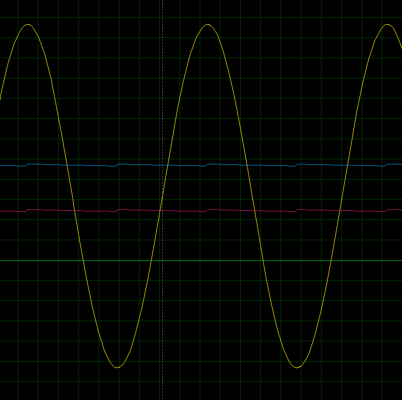

---

# Project Gallery

## Schematic Diagram

Complete schematic designed in KiCad.


---

## Initial PCB Layout

First routed PCB layout.


---

## Final PCB Layout

Completed PCB routing ready for Gerber generation and fabrication.


---

## Initial 3D PCB View

Initial 3D visualization.


---

## Final 3D PCB View (Front)

Completed PCB viewed from the component side.


---

## Final 3D PCB View (Back)

Completed PCB viewed from the solder side.


---

## Proteus Simulation

Bridge rectifier simulation demonstrating AC-to-DC conversion.


---

# PCB Fabrication Equipment

The fabrication process involves several specialized machines that support PCB production from raw copper-clad boards to finished printed circuit boards.

The following equipment will be used during the manufacturing process.

---

## PCB Prototyping Process

The PCB prototyping workflow illustrates the sequence of manufacturing steps used to transform the PCB design into a physical circuit board.

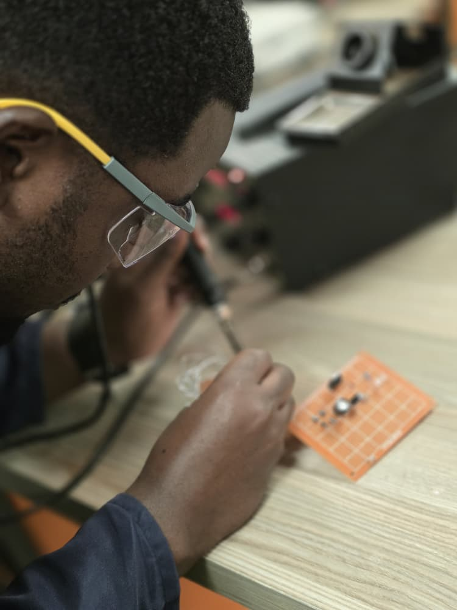

---

## Through-Hole PCB

Example of a through-hole PCB used during the fabrication and assembly process.

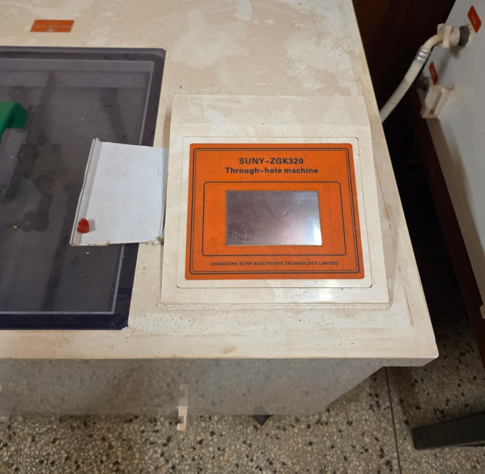

---

## Through-Hole Drilling Machine

Machine used for drilling component mounting holes after PCB fabrication.

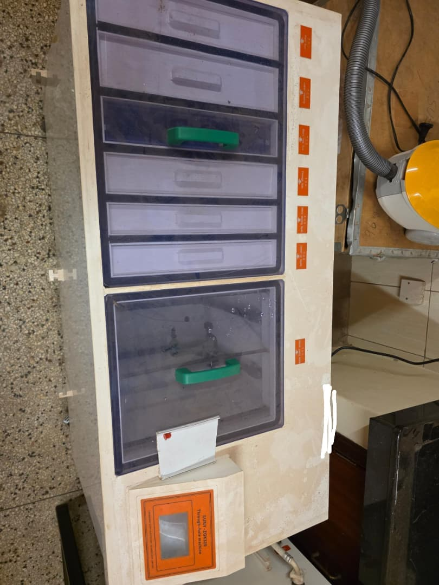

---

## Circuit Board Buffing Machine

Used to clean and polish the PCB surface before and after various fabrication processes, improving surface quality and solderability.

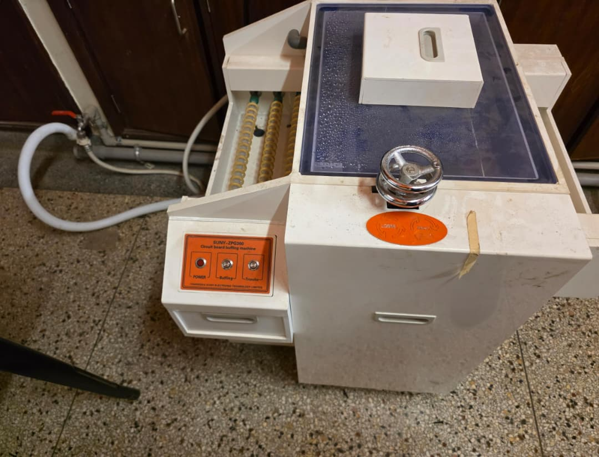

---

## Spray Stripping Machine

Used to remove photoresist after the PCB etching process, leaving the required copper traces on the board.

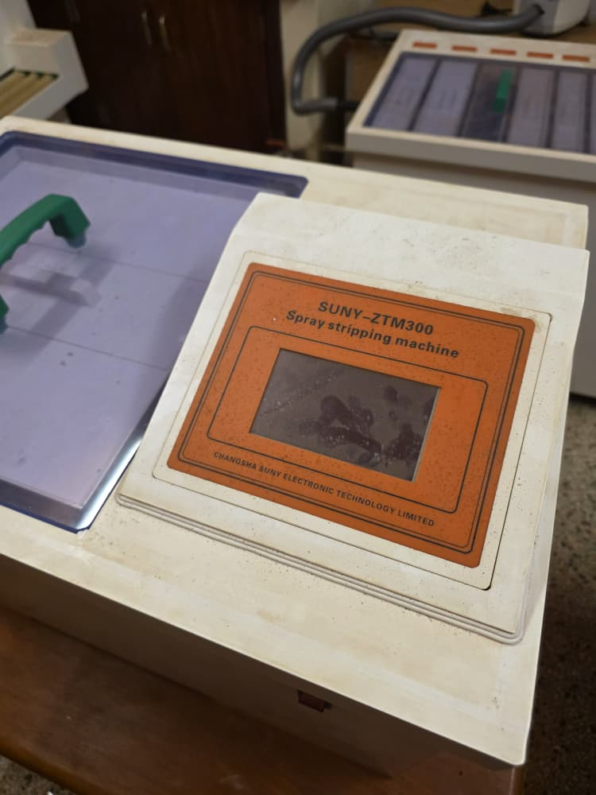

---

# PCB Fabrication Training

Before manufacturing the LED bulb PCB, practical PCB fabrication techniques were carried out using a **12 V to 5 V Buck Converter** as a training project. This provided hands-on experience with the complete PCB fabrication workflow and the operation of the equipment available in the PCB fabrication laboratory.

The objective was to understand how a PCB progresses from a digital design to a fully fabricated circuit board before applying the same techniques to the LED bulb project.

The fabrication process followed these stages:

- A single-layer copper-clad PCB was selected because the circuit required only one copper layer and no vias.
- The copper surface was thoroughly cleaned to remove contaminants and improve toner adhesion.
- The PCB layout was printed onto transfer paper and transferred onto the copper-clad board using the toner transfer method with heat and pressure.
- The board was immersed in Ferric Chloride solution to chemically etch away the exposed copper, leaving only the required PCB traces protected by the toner.
- The remaining toner was removed using ethanol, exposing clean copper tracks on the FR4 substrate.
- The fabricated PCB was then prepared for the remaining finishing processes, including drilling, solder mask application and silkscreen printing.

This practical exercise provided valuable experience in PCB fabrication techniques, chemical etching, surface preparation and manufacturing processes that will be applied during the fabrication of the 5 W LED bulb PCB developed in this repository.

## From Digital Design to Copper-Clad Board

The PCB fabrication process began by preparing a clean copper-clad board while referencing the digital PCB layout. This marked the transition from the computer-aided PCB design to the physical manufacturing process.

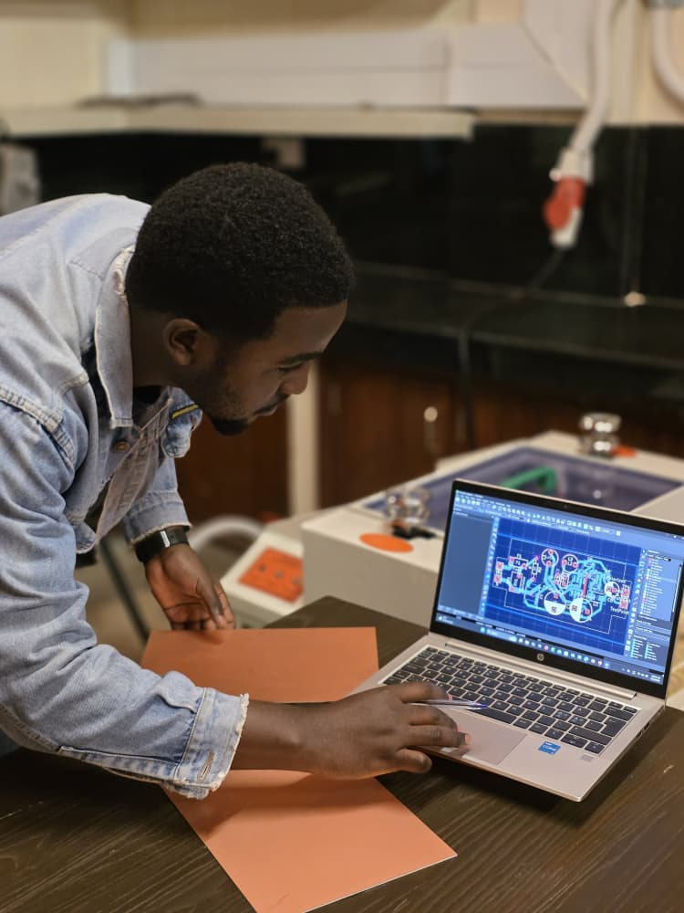

---

## PCB with Toner Transfer

The PCB layout was transferred onto the cleaned copper-clad board using the toner transfer method. The toner formed a protective layer over the required copper traces before chemical etching.

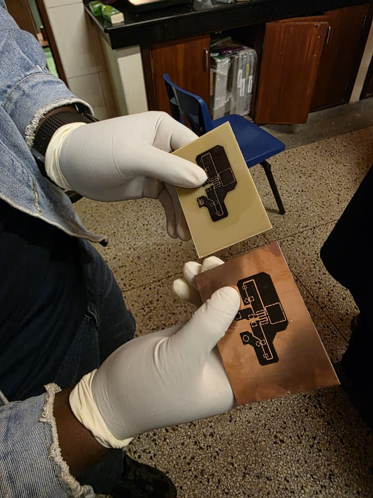

---

## Ferric Chloride Etching

The board was immersed in a Ferric Chloride solution to dissolve the exposed copper while preserving the toner-protected PCB traces.

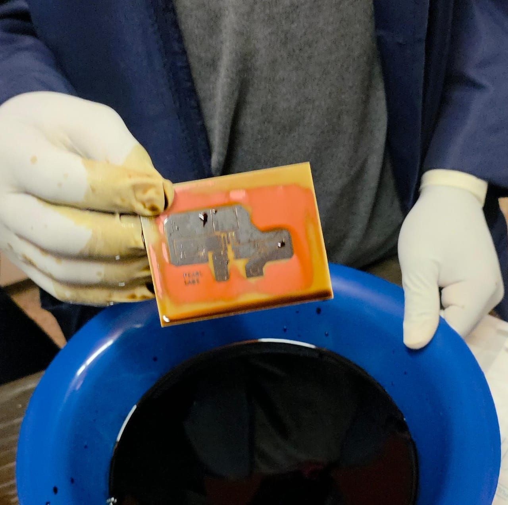

---

## PCB after Toner Removal

After chemical etching, the toner was removed using ethanol to expose the finished copper traces on the FR4 substrate. At this stage, the PCB pattern was fully formed and ready for drilling.

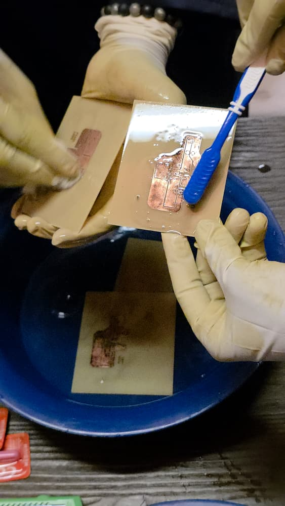

---

## PCB Drilling

Component mounting holes were drilled at the required locations using a PCB drilling machine, preparing the board for component placement and soldering.

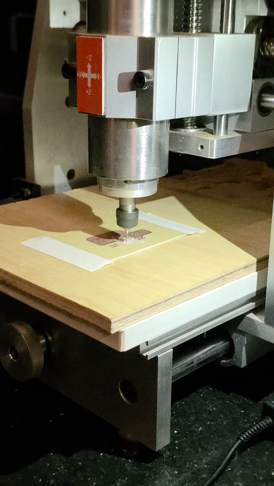

---

## Heat Press Machine

A heat press machine was used during the toner transfer process to firmly bond the printed PCB artwork onto the copper-clad board. Proper heat and pressure ensured accurate transfer of the circuit pattern before chemical etching.

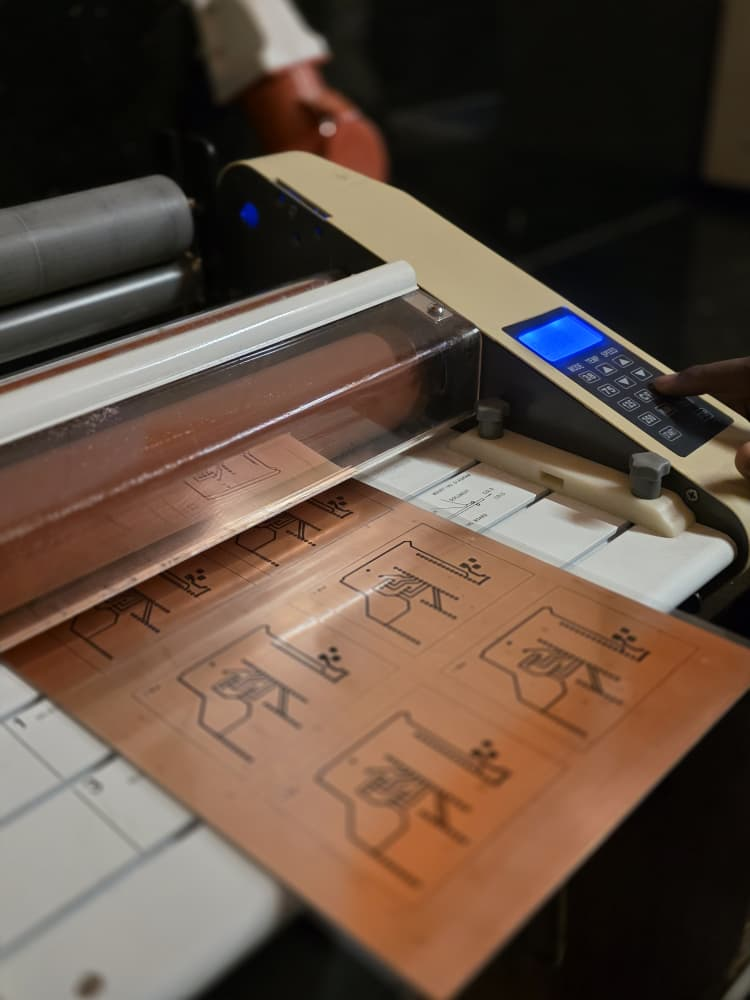

---
After chemical etching, the remaining toner was removed using ethanol to expose the finished copper traces on the FR4 substrate. At this stage, the PCB pattern had been successfully transferred onto the board and was ready for the remaining manufacturing processes.

The subsequent fabrication stages typically include:

- PCB drilling for through-hole components and mounting holes
- Surface cleaning and inspection
- Tin coating or surface finishing (where applicable) to protect exposed copper
- Solder mask application to insulate and protect the copper traces from oxidation and accidental short circuits
- Silkscreen printing to add component labels, reference designators and other markings
- Electrical continuity and quality inspection
- Component assembly and soldering
- Functional testing of the completed PCB

These finishing processes transform the etched PCB into a fully assembled and production-ready electronic circuit.
---

## Engineering Considerations

During the PCB design process, attention was given to:

- Proper component placement
- Efficient PCB routing
- Trace spacing
- Design for Manufacturability (DFM)
- Electrical Rule Check (ERC)
- Design Rule Check (DRC)
- PCB inspection using the KiCad 3D Viewer

---

## Future Work

The remaining stages of the project include:

- Generate Gerber files
- Manufacture the PCB
- Assemble the LED bulb
- Perform electrical testing
- Measure efficiency
- Evaluate thermal performance
- Produce final engineering documentation

---

## Learning Outcomes

Working on this project has provided practical experience in:

- PCB design using KiCad
- Circuit simulation using Proteus
- PCB routing techniques
- Power electronics
- Electronics manufacturing workflow
- Git and GitHub
- Engineering documentation


## License

This repository is shared for educational and portfolio purposes.

Please contact the repository owner before using any part of this design for commercial applications.